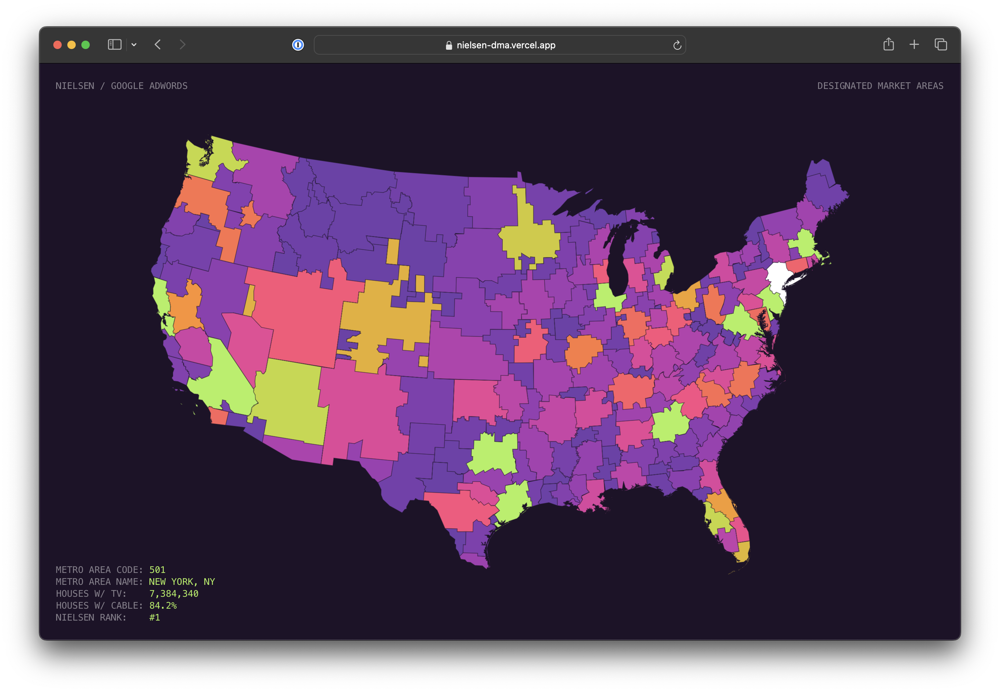

# Nielsen DMA Map



A map of the Nielen [Designated Marketing Areas](http://en.wikipedia.org/wiki/Media_market). Also is corresponds to the Google Ads (AdWords) metropolitan areas. Hover over for data related to each area. 

### Recommended IDE Setup

[VSCode](https://code.visualstudio.com/) + [Volar](https://marketplace.visualstudio.com/items?itemName=Vue.volar) (and disable Vetur).

### Customize configuration

See [Vite Configuration Reference](https://vitejs.dev/config/).

## Project Setup

```sh
npm install
```

#### Compile and Hot-Reload for Development

```sh
npm run dev
```

#### Compile and Minify for Production

```sh
npm run build
```

### Credits

* Adapted from [simzou/nielsen-dma](https://github.com/simzou/nielsen-dma/)
* Map adapted from Mike Bostock's [map example](http://bl.ocks.org/mbostock/2206590)
* Original topojson made by converting shapefile from [here](http://geocommons.com/overlays/306767) to topojson via [Mike Bostock's instructions](http://bost.ocks.org/mike/map/)
     * Shapefile link is dead, an archived Geojson from Geocommons can be found [here](https://raw.githubusercontent.com/geoiq/gc_data/master/datasets/998.geojson)
* Nielsen rank and TV data via [tvb](http://www.tvb.org/media/file/TVB_Market_Profiles_Nielsen_Household_DMA_Ranks2.pdf)